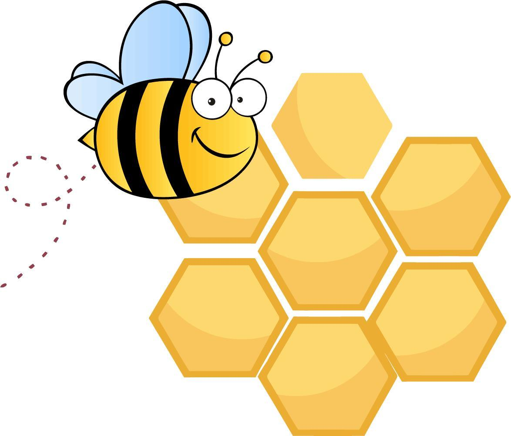

# FastAPI Hive

    <em>FastAPI Hive Framework, packages&modules code structure, developer-friendly, easy to be integrated</em>

Based on [fastapi-ml-skeleton](https://github.com/eightBEC/fastapi-ml-skeleton)

Refactor code into module management, ie, every modules could be set in one folder.

Go to detailed site for more information [FastAPI Hive](https://fanqingsong.github.io/fastapi-hive/)

This repository contains a demo app and fastapi modules which can be used to speed-up your next machine learning project. The code is fully tested and provides a preconfigured `tox` to quickly expand this sample code.

To experiment and get a feeling on how to use this framework, two packages and two modules of each package are set in the demo folder. Follow the installation and setup instructions to run the demo app and serve it with RESTful API, go to [FastAPI Hive](https://fanqingsong.github.io/fastapi-hive/) for that.

