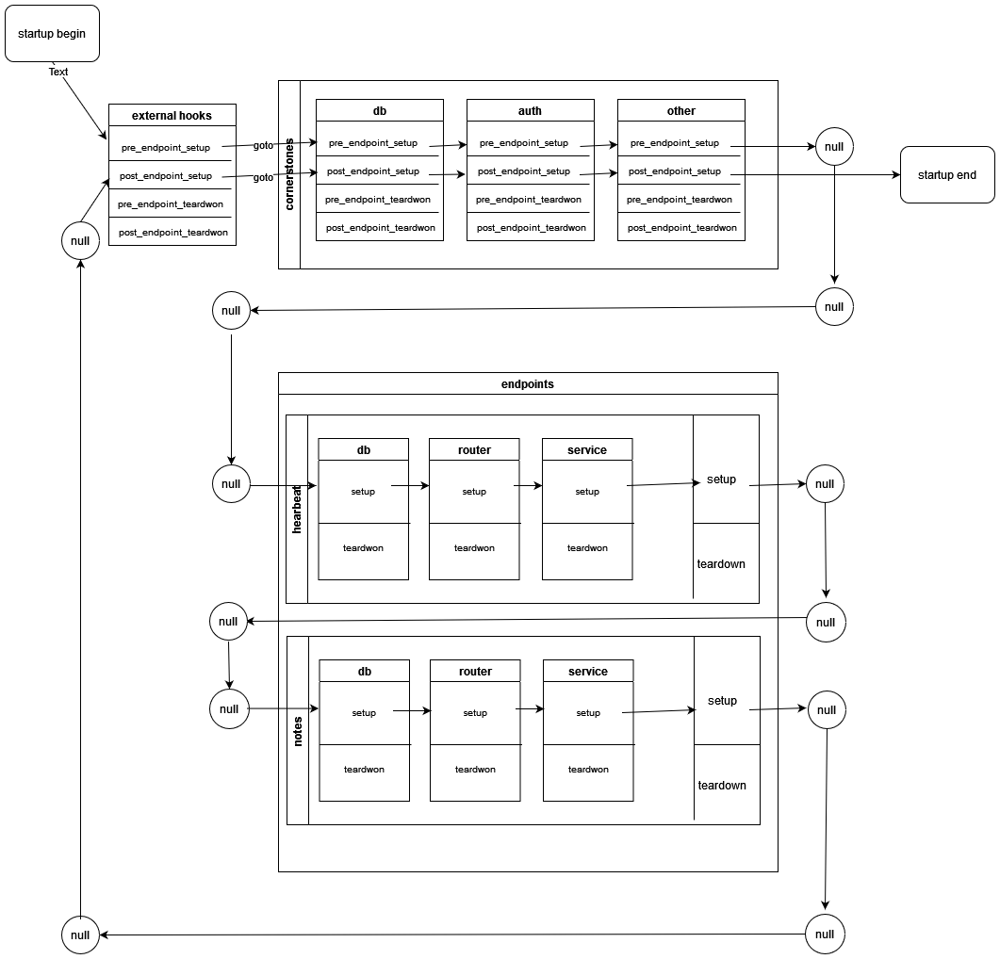

# FastAPI Hive

    <em>FastAPI Hive Framework, modulization code layout tools, decoupling codes into cornerstones and endpoints, developer-friendly, easy to be integrated</em>

The classical code structure is compliant with function components view with the function folders, such as "api" folder for router registering, "models" folder for db and pydantic data model, just like [fastapi-ml-skeleton](https://github.com/eightBEC/fastapi-ml-skeleton).

But from the system design view, the system is divided into serveral sub-service, such as "heartbeat" service and "house_price" service in the above example, each of two services contains "api" and "model" function components.

With the help of fastapi-hive container_name, you can layout code structure by service style. For each service, it is defined as one endpoint, the codes are gathered in one endpoint folder, Also for the common functions, like db, auth, etc..., they are defined as cornerstones which are for constructing the hive(bee's home), and every bee are endpoints to go to hive.

Go to detailed site for more information [FastAPI Hive](https://fanqingsong.github.io/fastapi-hive/)

This repository contains a example app with cornerstones and endpoints folder which can be used to speed-up your next machine learning project. The code is fully tested and provides a preconfigured `tox` to quickly expand this sample code.

To experiment and get a feeling on how to use this framework, follow the installation and setup instructions to run the example app and serve it with RESTful API, go to [FastAPI Hive](https://fanqingsong.github.io/fastapi-hive/) for that.

