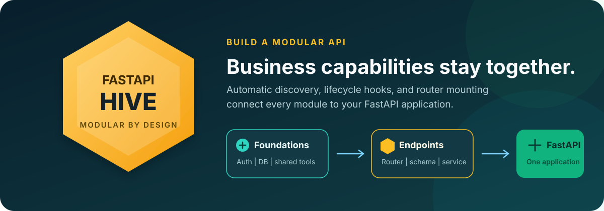
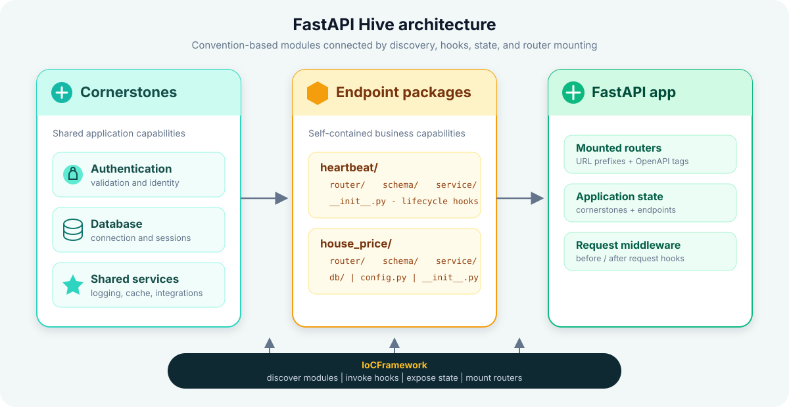
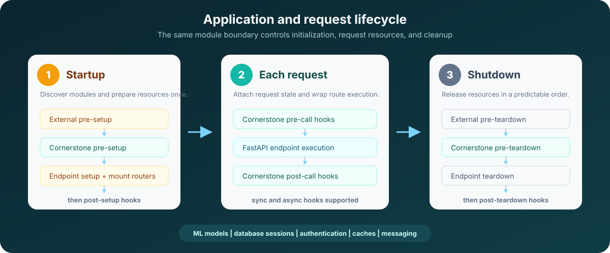

# FastAPI Hive

<p align="center">
  <strong>Organize FastAPI applications around business capabilities, not technical layers.</strong>
</p>

<p align="center">
  Keep each API, schema, service, and model together; share infrastructure through reusable foundations.
</p>

<p align="center">
  <a href="https://github.com/fanqingsong/fastapi-hive/actions"></a>
  <a href="https://codecov.io/gh/fanqingsong/fastapi-hive"></a>
  <a href="https://www.python.org/"></a>
  <a href="https://pypi.org/project/fastapi-hive/"></a>
  <a href="https://github.com/fanqingsong/fastapi-hive/blob/master/LICENSE"></a>
  <a href="https://pepy.tech/project/fastapi-hive"></a>
</p>

<p align="center">
  <a href="https://fanqingsong.github.io/fastapi-hive/">Documentation</a>
  ·
  <a href="https://github.com/fanqingsong/fastapi-hive/tree/master/example">Example application</a>
  ·
  <a href="https://pypi.org/project/fastapi-hive/">PyPI</a>
</p>



## Why FastAPI Hive?

Layer-based layouts work well at first, but related code becomes scattered as an
application grows:

```text
app/                             app/
├── routers/                     ├── foundations/
│   ├── heartbeat.py             │   ├── auth/
│   └── house_price.py           │   └── db/
├── schemas/          ──────▶    └── endpoints/
│   ├── heartbeat.py                 ├── heartbeat/
│   └── house_price.py               │   ├── router/
├── services/                        │   ├── schema/
│   └── house_price.py               │   └── service/
└── main.py                          └── house_price/
                                         ├── router/
                                         ├── schema/
                                         └── service/
```

In the layout on the left, changing one business capability often means jumping
between `routers`, `schemas`, and `services`. FastAPI Hive enables the
capability-oriented layout on the right:

- **Endpoints are the bees** — each endpoint folder owns one business
  capability, including its router, schemas, service, and optional database
  models.
- **Foundations are the structure the hive is built on** — shared concerns such
  as authentication and database access live in independently initialized modules.
- **The IoC framework is the beekeeper** — it discovers modules, runs their
  lifecycle hooks, and exposes their state. Endpoints mount their own routers.

The result is less registration code in `main.py`, clearer ownership, and
modules that are easier to review, test, move, or remove.

## How it works



At initialization, `IoCFramework` scans the configured package paths and imports
each child module. It then:

1. discovers decorated modules in the same scan,
   then exposes published values through the hive registry;
2. registers synchronous and asynchronous startup/shutdown hooks;
3. lets each endpoint mount its `APIRouter` from `startup`;
4. installs request middleware that runs foundation hooks before and after
   each request.



This lifecycle is useful for resources that must be prepared once—such as an ML
model, a database connection, or an authentication provider—and for resources
that must be attached to each request.

## Core capabilities

- **Capability-oriented modules** — colocate all code for one endpoint.
- **Automatic discovery** — load foundations and multiple endpoint packages
  from configurable paths.
- **Explicit router mounting** — include each endpoint's `APIRouter` in
  `startup` with `self.app.include_router(...)`.
- **Lifecycle hooks** — run sync or async startup and shutdown code at application,
  module, and request boundaries. `@runner` is the application-level callback
  after foundation and endpoint startup.
- **Bean graph and auto-configuration** — `@provides` / `@component` become
  definitions; `HiveContext` creates them by type. Starters register via the
  `hive.autoconfigure` entry point and `@conditional` (`on_import`, `on_missing`,
  `on_bean`, `enabled_when`). Routes and hooks read beans through `Inject`.
- **Incremental adoption** — wrap an existing FastAPI app with only a small
  bootstrap block.

## Quick start

### 1. Install

The package published on PyPI can lag behind this repository. Install from the local source:

```bash
git clone https://github.com/fanqingsong/fastapi-hive.git
cd fastapi-hive
pip3 install .
```

FastAPI Hive supports Python 3.8 through Python 3.13.

### 2. Organize the application

```text
my_app/
├── foundations/
│   ├── auth/
│   │   ├── __init__.py
│   │   └── implement.py
│   └── db/
│       ├── __init__.py
│       └── implement.py
├── endpoints/
│   ├── heartbeat/
│   │   ├── router/
│   │   ├── schema/
│   │   └── service/
│   └── house_price/
│       ├── router/
│       ├── schema/
│       └── service/
└── main.py
```

An endpoint keeps a regular FastAPI `APIRouter` and mounts it from `startup`:

```python
# example/endpoints_package2/heart_beat2/__init__.py
from .router.implement import router
from fastapi_hive.ioc_framework.decorators import endpoint
from fastapi_hive.ioc_framework.endpoint_hooks import EndpointHooks


@endpoint(name="heart_beat2")
class EndpointHooksImpl(EndpointHooks):
    def startup(self):
        self.app.include_router(router, prefix="/api/hb2", tags=["heartbeat-v2"])
```

### 3. Initialize the hive

If `foundation`/`foundations` and `endpoints` sit next to `main.py`, the
container picks them up by convention:

```python
from fastapi import FastAPI
from fastapi_hive.ioc_framework import IoCFramework

app = FastAPI(title="My API")
IoCFramework.bootstrap(app)
```

Override convention with `settings=` on `bootstrap`, or with `HIVE_*`
environment variables. Code overrides win over env, which wins over folder
convention:

```python
IoCFramework.bootstrap(app, settings={
    "api_prefix": "/api/v1",
    "endpoint_package_paths": ["./my_app/endpoints"],
})
```

```bash
export HIVE_API_PREFIX=/api/v1
export HIVE_ENDPOINT_PACKAGE_PATHS=./pkg1,./pkg2
```

You can still assign `hive.config.*` in code after construction.

Mount each router with the prefix you want, for example `/api/v1/heartbeat`.

### 4. Add lifecycle behavior

Decorate a hook class in the endpoint package for lifecycle only. Put
`@provides` on an `@autoconfigure` class, not on `startup` / `configure` /
other lifecycle hooks:

```python
# my_app/endpoints/house_price/service/__init__.py
from fastapi_hive.ioc_framework.decorators import autoconfigure, provides

from .implement import HousePriceModel


@autoconfigure(name="house_price.model")
class HousePriceModelAuto:
    @provides(HousePriceModel)
    def model(self):
        return HousePriceModel("model.joblib")
```

The route receives that object through `Inject`. FastAPI analyzes routes at
import time, so route parameters need an `Inject` default (not a bare type):

```python
from fastapi_hive.ioc_framework.registry import Inject

def predict(model: HousePriceModel = Inject(HousePriceModel)):
    return model.predict(payload)
```

Foundations use `@foundation` for lifecycle side effects. App-scoped beans
are created at bootstrap (`refresh`). Request-scoped beans are created on first
`get` in that request. Hook methods and `__init__` take the same keys as
parameters (type hints or `Inject`).

Third-party starters:

```toml
[project.entry-points."hive.autoconfigure"]
hive.db = "hive_sqlalchemy.auto:SqlAlchemyAuto"
```

```python
@autoconfigure(name="hive.db")
@conditional(on_import="sqlalchemy", on_missing="db", enabled_when="db")
class SqlAlchemyAuto:
    @provides("db")
    def engine(self):
        return create_engine(...)
```

A user `@provides("db")` wins over the starter because of `on_missing`. Exclude
with `hive.autoconfigure.exclude: ["hive.db"]`.

`order` controls hook order.
`profiles` and `enabled_when` skip a module unless `ACTIVE_PROFILES` or
`FEATURES` enables it. Mount routers in `startup` with `include_router`.

Hook methods may be `def` or `async def`. The framework always invokes them
from an async lifecycle. `FoundationHooks.configure()` is the exception: it
runs while the app is assembled and must stay synchronous so middleware can
be registered. Blocking I/O in a hook should use `anyio.to_thread.run_sync`.

## Run the example

The included application demonstrates:

- API-key authentication as a foundation;
- database setup and request-scoped access as a foundation;
- heartbeat endpoints (package2 mounts at `/api/hb2`);
- ML model preloading and house-price prediction;
- endpoint discovery across two endpoint packages.

```bash
git clone https://github.com/fanqingsong/fastapi-hive.git
cd fastapi-hive
pip3 install -e .
pip install -r requirements.txt
cp example/.env.example example/.env
uvicorn example.main:app --reload
```

`pip3 install -e .` installs this checkout in editable mode, so the example imports the local `fastapi_hive` package. `make run-example` runs that install and then starts the app.

Open [http://localhost:8000/docs](http://localhost:8000/docs) to explore the
generated OpenAPI interface. `GET /hive/routers` lists routes mounted on the
app (`heart_beat2` is at `/api/hb2/heartbeat`).
Configure `API_KEY` in `example/.env` before trying authenticated endpoints;
`docs/sample_payload.json` contains a prediction request example.

## Test

```bash
tox
```

## Learn more

- [Why a capability-oriented layout?](https://fanqingsong.github.io/fastapi-hive/why/)
- [Integration guide](https://fanqingsong.github.io/fastapi-hive/how/)
- [Architecture and hook lifecycle](https://fanqingsong.github.io/fastapi-hive/design/)
- [Practical use cases](https://fanqingsong.github.io/fastapi-hive/usecases/)

## License

FastAPI Hive is released under the [Apache License 2.0](LICENSE).
