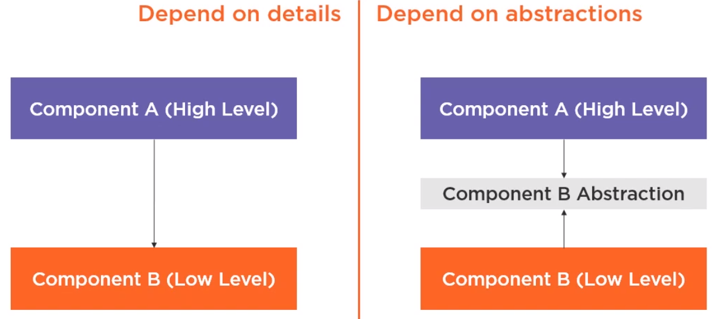
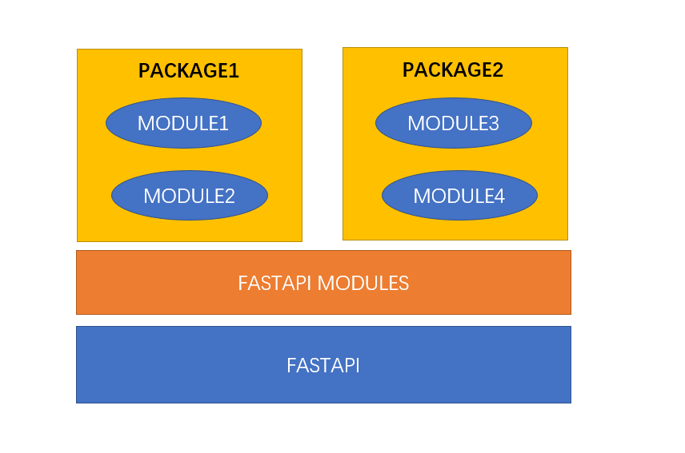

# Design Idea

    <em>
    DIP is one of the SOLID object-oriented principle invented by Robert Martin (a.k.a. Uncle Bob)
    </em>

    DIP Definition

    * High-level cornerstones should not depend on low-level cornerstones. 
        Both should depend on the abstraction.

    * Abstractions should not depend on details. 
        Details should depend on abstractions.

---

**Source**: <a href="https://martinfowler.com/articles/injection.html" target="_blank">https://martinfowler.com/articles/injection.html</a>

**Theory**: <a href="https://www.cs.utexas.edu/users/downing/papers/DIP-1996.pdf" target="_blank">https://www.cs.utexas.edu/users/downing/papers/DIP-1996.pdf</a>

**Example**: <a href="https://www.geeksforgeeks.org/dependecy-inversion-principle-solid/" target="_blank">https://www.geeksforgeeks.org/dependecy-inversion-principle-solid/</a>

**Tutorial**: <a href="https://www.tutorialsteacher.com/ioc" target="_blank">https://www.tutorialsteacher.com/ioc</a>

## Architecture

---

FastAPI Hive Framework loads packages of cornerstones and endpoints, It extracts the cornerstone and enpoint functions abstraction meta properties, and provide hooks mechanism to setup environment. As of router, it will be mounted into app during app startup automatically.

---

startup running flow:

