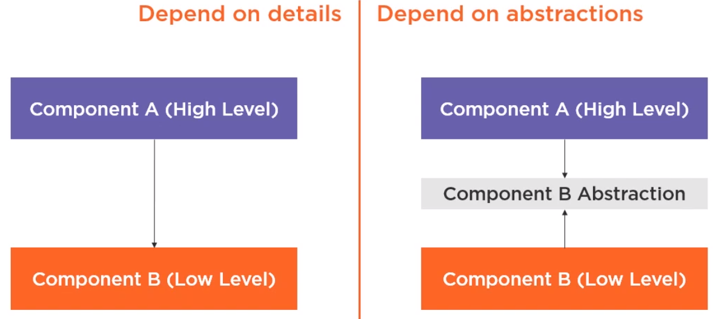

# Design Idea

    <em>
    DIP is one of the SOLID object-oriented principle invented by Robert Martin (a.k.a. Uncle Bob)
    </em>

    DIP Definition

    * High-level modules should not depend on low-level modules. 
        Both should depend on the abstraction.

    * Abstractions should not depend on details. 
        Details should depend on abstractions.

---

**Source**: <a href="https://martinfowler.com/articles/injection.html" target="_blank">https://martinfowler.com/articles/injection.html</a>

**Theory**: <a href="https://www.cs.utexas.edu/users/downing/papers/DIP-1996.pdf" target="_blank">https://www.cs.utexas.edu/users/downing/papers/DIP-1996.pdf</a>

**Example**: <a href="https://www.geeksforgeeks.org/dependecy-inversion-principle-solid/" target="_blank">https://www.geeksforgeeks.org/dependecy-inversion-principle-solid/</a>

**Tutorial**: <a href="https://www.tutorialsteacher.com/ioc" target="_blank">https://www.tutorialsteacher.com/ioc</a>

---

FastAPI Modules Framework loads modules of packages, It extracts the abstraction Module properties, including router and service, which will be mounted into app during app startup.

---
## Application

From code view, router and service property must be set in __init__.py.

    app
        packages
            heartbeat
                api.py
                models.py
                service.py
                __init__.py

