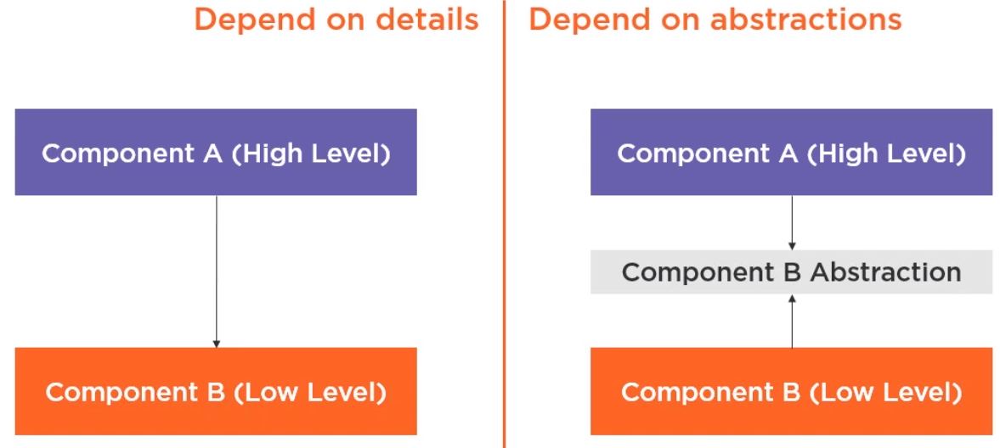
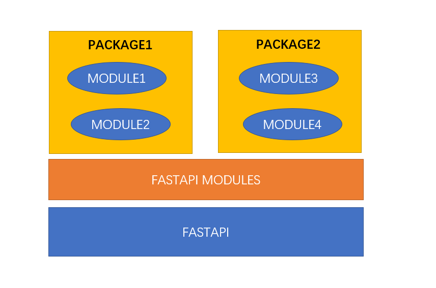
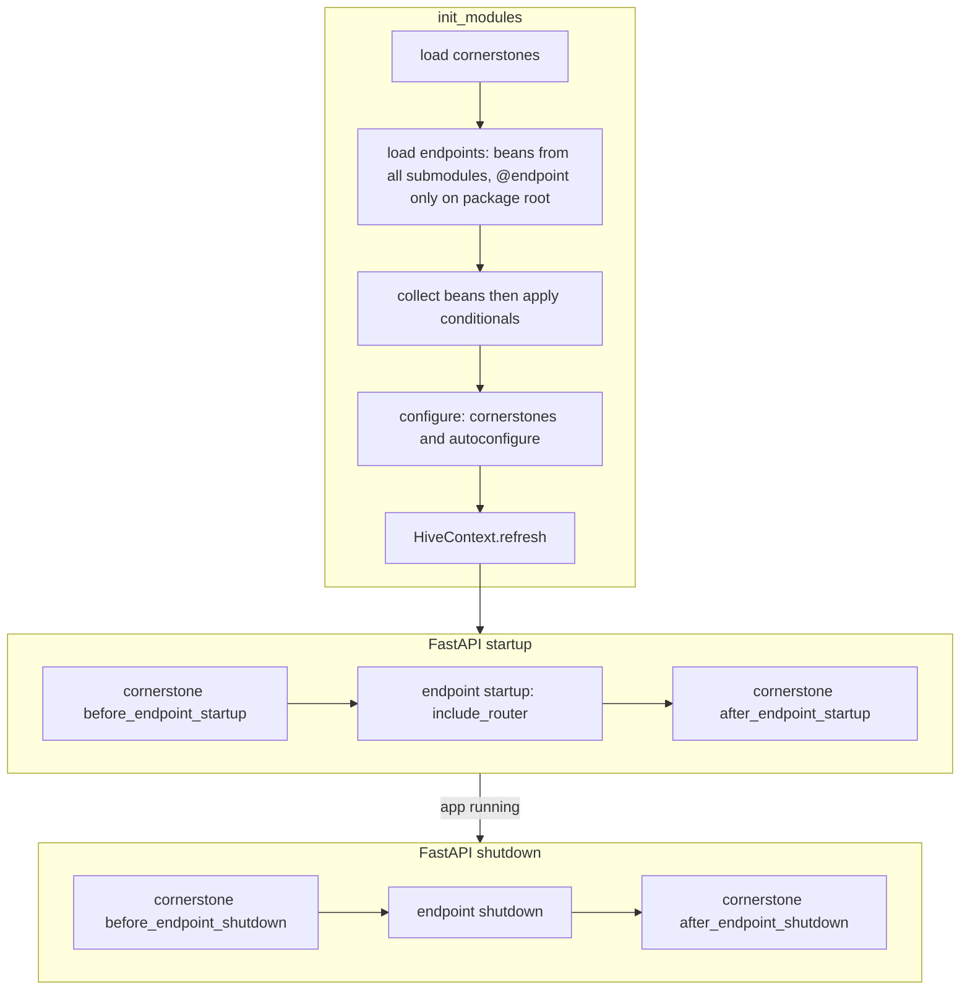

# Design

## DIP Principle

    <em>
    DIP is one of the SOLID object-oriented principle invented by Robert Martin (a.k.a. Uncle Bob)
    </em>

    DIP Definition

    * High-level cornerstones should not depend on low-level cornerstones. 
        Both should depend on the abstraction.

    * Abstractions should not depend on details. 
        Details should depend on abstractions.

---

**Source**: <a href="https://martinfowler.com/articles/injection.html" target="_blank">https://martinfowler.com/articles/injection.html</a>

**Theory**: <a href="https://www.cs.utexas.edu/users/downing/papers/DIP-1996.pdf" target="_blank">https://www.cs.utexas.edu/users/downing/papers/DIP-1996.pdf</a>

**Example**: <a href="https://www.geeksforgeeks.org/dependecy-inversion-principle-solid/" target="_blank">https://www.geeksforgeeks.org/dependecy-inversion-principle-solid/</a>

**Tutorial**: <a href="https://www.tutorialsteacher.com/ioc" target="_blank">https://www.tutorialsteacher.com/ioc</a>

## Architecture

### Three Layers

Based on FastAPI framework, FastAPI-Hive Framework supports two components: cornerstone and endpoint.

cornerstone for common modules which are dependent on by endpoints.

endpoint for every service module which expose routers on swagger API page.

---

### Initialization Precedure of Startup

FastAPI Hive Framework loads packages of cornerstones and endpoints, It covers the cornerstone and enpoint common initialization requirements, and provide hooks mechanism to startup/shutdown environment. Endpoints mount their own routers from startup hooks.

so the overview of precedure:
* loading cornerstones
* loading endpoints (recursive package walk for beans; `@endpoint` only on the package root)
* collect bean definitions from scan + `hive.autoconfigure` entry points + `AUTOCONFIGURE_IMPORTS`
* filter with `@conditional` (static checks, then `on_bean` / `on_missing` rounds)
* run `configure()` (cornerstone hooks and accepted autoconfigure classes)
* `HiveContext.refresh()` creates app-scoped singletons
* call startup hooks

---

#### Startup hooks calling flow:

There are serveral stages in startup hooks calling stages:
* call cornerstones' before_endpoint_startup hooks one by one.
* call endpoints' startup hooks one by one. `@endpoint` classes must be defined in the endpoint package root (`__init__.py`). Mount `APIRouter` instances here with `app.include_router`.
* call cornerstones' after_endpoint_startup hooks one by one

The same is as with shutdown hooks calling logic.

```mermaid
flowchart TD
  subgraph bootstrap [init_modules]
    loadCS[load cornerstones]
    loadEP["load endpoints: beans from all submodules, @endpoint only on package root"]
    beans[collect beans then apply conditionals]
    configure["configure: cornerstones and autoconfigure"]
    refresh[HiveContext.refresh]
    loadCS --> loadEP --> beans --> configure --> refresh
  end

  subgraph startupEvent [FastAPI startup]
    beforeStart[cornerstone before_endpoint_startup]
    epStart["endpoint startup: include_router"]
    afterStart[cornerstone after_endpoint_startup]
    beforeStart --> epStart --> afterStart
  end

  subgraph shutdownEvent [FastAPI shutdown]
    beforeStop[cornerstone before_endpoint_shutdown]
    epStop[endpoint shutdown]
    afterStop[cornerstone after_endpoint_shutdown]
    beforeStop --> epStop --> afterStop
  end

  refresh --> startupEvent
  startupEvent -->|"app running"| shutdownEvent
```

### Per-request setup

Cornerstone hooks do not run on each HTTP request. Register middleware from `configure()` when a request needs a resource opened before the endpoint and closed afterwards, for example a database session. Middleware can see the response, run cleanup when the endpoint raises, and nest in registration order.

