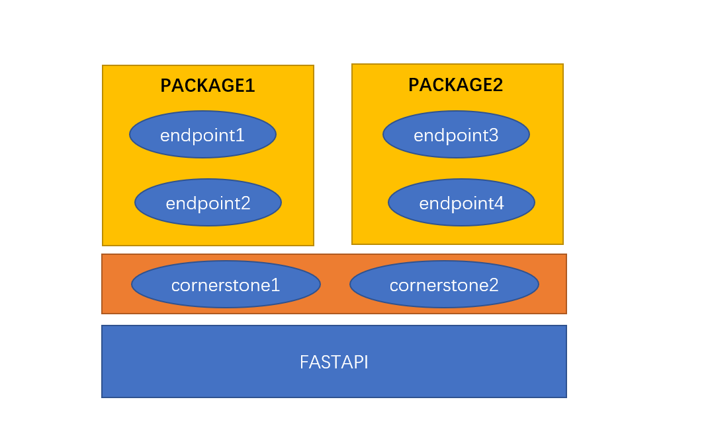

# Design

## DIP Principle

    <em>
    DIP is one of the SOLID object-oriented principle invented by Robert Martin (a.k.a. Uncle Bob)
    </em>

    DIP Definition

    * High-level cornerstones should not depend on low-level cornerstones. 
        Both should depend on the abstraction.

    * Abstractions should not depend on details. 
        Details should depend on abstractions.

---

**Source**: <a href="https://martinfowler.com/articles/injection.html" target="_blank">https://martinfowler.com/articles/injection.html</a>

**Theory**: <a href="https://www.cs.utexas.edu/users/downing/papers/DIP-1996.pdf" target="_blank">https://www.cs.utexas.edu/users/downing/papers/DIP-1996.pdf</a>

**Example**: <a href="https://www.geeksforgeeks.org/dependecy-inversion-principle-solid/" target="_blank">https://www.geeksforgeeks.org/dependecy-inversion-principle-solid/</a>

**Tutorial**: <a href="https://www.tutorialsteacher.com/ioc" target="_blank">https://www.tutorialsteacher.com/ioc</a>

## Architecture

### Three Layers

Based on FastAPI framework, FastAPI-Hive Framework supports two components: cornerstone and endpoint.

cornerstone for common modules which are dependent on by endpoints.

endpoint for every service module which expose routers on swagger API page.

---

### Initialization Precedure of Startup

FastAPI Hive Framework loads packages of cornerstones and endpoints, It covers the cornerstone and enpoint common initialization requirements, and provide hooks mechanism to setup/teardown environment. As of router, it will be mounted into app during app startup automatically.

so the overview of precedure:
* loading cornerstones
* loading endpoints
* call setup hooks to initialize all modules

---

#### Setup hooks calling flow:

There are serveral stages in setup hooks calling stages:
* call external pre_endpoint_setup hook (from global part)
* call cornerstones' pre_endpoint_setup hooks one by one.
* call endpoints' setup hooks one by one, but in this stage, there are three in-built sub-modules(db/service/router) which also can be hooked.
* call external post_endpoint_setup hook
* call cornerstones' post_endpoint_setup hooks one by one

The same is as with teardown hooks calling logic.

### Initialization Precedure of Request

Beside setup and teardown hooks, maybe you also notice that there are two extra hooks (pre_endpoint_call/post_endpoint_call) in above picture.

Yes, it is just for setup some resource before handling request.

For example, db.connect is expected before endpoint handle request, and db.disconnect is expected after endpoint handle request.

It is implemented in a in-built http middleware.
The flow is like below:

    ---> request 
    ---> cornerstones' pre_endpoint_call 
    ---> endpoint excution 
    ---> cornerstones' post_endpoint_call

