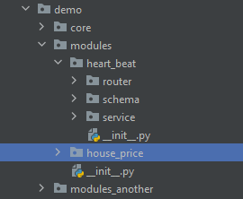

# How to Use?

FastAPI Modules Framework is the solution to the problems in why chapter.

---

## Install it.

First, git clone this repo.

```bash
git clone git@github.com:fanqingsong/fastapi-ml-skeleton.git
```

Second, install IoC Container Package<br/>
<small>Note: If just treat it as a library, and want to integrate it into your app, you can just run this command. </small>

```bash
python3 setup.py install
```

---

## Integrate it into your app

Note: You can reference demo code to complete this part. 

First, create or refactor you code into module:



Second, setup the initial sentence of ioc_container in main.py

```Python
from fastapi import FastAPI
from loguru import logger
from demo.core.config import (APP_NAME, APP_VERSION, API_PREFIX,
                              IS_DEBUG)

from fastapi_modules.ioc_framework import ioc_framework


def get_app() -> FastAPI:
    logger.info("app is starting.")

    fast_app = FastAPI(title=APP_NAME, version=APP_VERSION, debug=IS_DEBUG)

    ioc_framework
    .bind_app(fast_app)
    .set_params({
        "API_PREFIX": API_PREFIX,
        "MODULE_PACKAGE_PATHS": ["./demo/modules"]
    })
    .init()


# ioc_framework.delete_module_packages(["./demo/modules"])
ioc_framework.add_module_packages(["./demo/modules_another"])

return fast_app

app = get_app()

```
