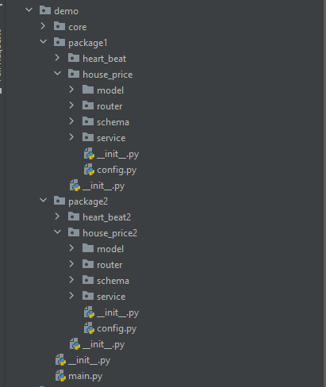

# How

FastAPI Hive Framework is the solution to the problems in "why" chapter.
In this chapter, let see how to apply it in project.

---

## Install it.

The package published on PyPI can lag behind this repository. Install from the local source instead.

```bash
git clone git@github.com:fanqingsong/fastapi-hive.git
cd fastapi-hive
pip3 install .
```


---

## Integrate it into your app

Note: You can reference example code to complete this part. 

### Make packages of foundations and endpoints

First, create or refactor you code into foundations and endpoints folders:



Code Folder Structure

    app
        foundations
            db
                __init__.py
                implement.py
            auth
                __init__.py
                implement.py
        endpoint_packages
            heartbeat
                api.py
                models.py
                service.py
                __init__.py
            house_price
                api.py
                models.py
                service.py
                __init__.py


From code view, the startup or shutdown hooks should be set in the endpoint
package root `__init__.py`. An `@endpoint` class in a submodule is rejected.

Decorate the hook class. `order` decides who runs first in the same phase. `profiles` must overlap `ACTIVE_PROFILES` when it is set. `enabled_when` reads a dotted key from `FEATURES`. `@provides` / `@component` register beans on `HiveContext`. Lifecycle methods cannot use `@provides`. Hook parameters and `Inject` resolve the same keys. `@autoconfigure` + `@conditional` load optional starters.

Only decorated hook classes are loaded. Methods may be `def` or `async def`. `configure()` on a foundation must stay synchronous so middleware can be registered before the app starts. Blocking I/O in a hook should use `anyio.to_thread.run_sync`.

Beans stay on an `@autoconfigure` class. Foundation hooks, such as `example/foundation/db`, stay on `@foundation`.

For a foundation bean

```Python

from fastapi_hive.ioc_framework.decorators import autoconfigure, provides
from example.foundation.auth.implement import validate_http_request


@autoconfigure(name="hive.auth", order=100)
class AuthAuto:

    @provides("auth.ok")
    def checker(self):
        return validate_http_request

```


Endpoint lifecycle stays on `@endpoint`. The model factory is separate:

For an endpoint bean

```Python

from fastapi_hive.ioc_framework.decorators import autoconfigure, provides
from example.endpoints_package1.house_price.service.implement import HousePriceModel
from example.endpoints_package1.house_price.config import DEFAULT_MODEL_PATH


@autoconfigure(name="house_price.model")
class HousePriceModelAuto:

    @provides(HousePriceModel)
    def model(self):
        return HousePriceModel(DEFAULT_MODEL_PATH)

```

Routes read registered objects with `Inject`:

```Python

from fastapi_hive.ioc_framework.registry import Inject

def post_predict(model: HousePriceModel = Inject(HousePriceModel)):
    return model.predict(block_data)

```

For the hooks running flow, please reference the diagram in
[Architecture](design.md). `@endpoint.startup` mounts routers; shutdown uses
the same three stages in reverse around endpoint `shutdown`.


### Setup hive framework init codes 

Second, bootstrap the container. Convention looks for `foundation(s)/` and
`endpoints/` beside the caller or the working directory. Put the rest in
`settings=` on `bootstrap`, or in `HIVE_*` environment variables.

```Python
from fastapi import FastAPI
from loguru import logger
from example.foundation.config import APP_NAME, APP_VERSION, IS_DEBUG

from fastapi_hive.ioc_framework import IoCFramework


def get_app() -> FastAPI:
    logger.info("app is starting.")
    fast_app = FastAPI(title=APP_NAME, version=APP_VERSION, debug=IS_DEBUG)
    IoCFramework.bootstrap(
        fast_app,
        settings={
            "api_prefix": "/api",
            "foundation_package_path": "./foundation",
            "endpoint_package_paths": [
                "./endpoints_package1",
                "./endpoints_package2",
            ],
        },
    )
    return fast_app


app = get_app()
```

Programmatic assignment (`hive.config.API_PREFIX = ...`) still works and wins
over env.

## URL MAPPING

The framework discovers foundations and endpoints in the same load pass.
`@endpoint` hook classes must live in the endpoint package root. Mount routers
yourself in `startup` with `self.app.include_router(...)`.

If the folder structure likes below

```text
    app
        endpoint_packages
            heartbeat
                router.py
                models.py
                service.py
            prediction
                router.py
                models.py
                service.py
        main.py
```

Then register routes in the endpoint startup hook, for example
`self.app.include_router(router, prefix="/api/heartbeat", tags=["heartbeat"])`.

The example `heart_beat2` module mounts at `/api/hb2`. `GET /hive/routers` on
the example app lists routes already included on the FastAPI app.

example/endpoints_package1/house_price/__init__.py


```python

from example.endpoints_package1.house_price.router.implement import router

from fastapi_hive.ioc_framework.endpoint_hooks import EndpointHooks
from fastapi_hive.ioc_framework.decorators import endpoint


@endpoint(name="house_price")
class EndpointHooksImpl(EndpointHooks):

    def startup(self):
        self.app.include_router(router, tags=["house_price"], prefix="/api/house_price")

```
