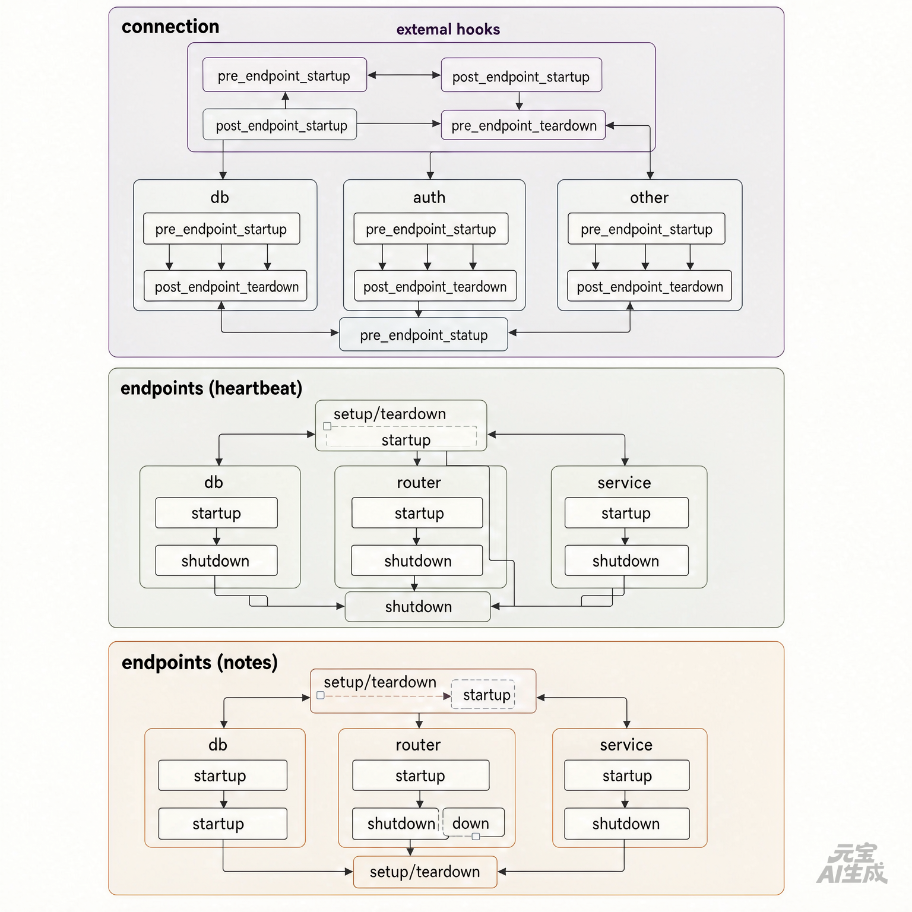

# How

FastAPI Hive Framework is the solution to the problems in "why" chapter.
In this chapter, let see how to apply it in project.

---

## Install it.

The package published on PyPI can lag behind this repository. Install from the local source instead.

```bash
git clone git@github.com:fanqingsong/fastapi-hive.git
cd fastapi-hive
pip3 install .
```


---

## Integrate it into your app

Note: You can reference example code to complete this part. 

### Make packages of cornerstones and endpoints

First, create or refactor you code into cornerstones and endpoints folders:


Code Folder Structure

    app
        cornerstones
            db
                __init__.py
                implement.py
            auth
                __init__.py
                implement.py
        endpoint_packages
            heartbeat
                api.py
                models.py
                service.py
                __init__.py
            house_price
                api.py
                models.py
                service.py
                __init__.py


From code view, the startup or shutdown hooks should be set in __init__.py if needed.

Decorate the hook class. `order` decides who runs first in the same phase. `profiles` must overlap `ACTIVE_PROFILES` when it is set. `enabled_when` reads a dotted key from `FEATURES`. `@provides` registers the method return value on the app registry. `@request_provides` registers it on the current request.

A module that is not decorated is still loaded when its class is named `CornerstoneHooksImpl`, `CornerstoneAsyncHooksImpl`, `EndpointHooksImpl`, or `EndpointAsyncHooksImpl`. Those legacy classes use `order=0` and stay enabled.

For cornerstone

```Python

from fastapi_hive.ioc_framework.cornerstone_hooks import CornerstoneHooks, CornerstoneAsyncHooks
from fastapi_hive.ioc_framework.decorators import cornerstone, provides
from example.cornerstone.auth.implement import validate_request


@cornerstone(name="auth", order=100)
class CornerstoneHooksImpl(CornerstoneHooks):

    @provides("auth.validate_request")
    def pre_endpoint_startup(self):
        print("call pre startup from CornerstoneHooksImpl!!!")
        print(self.app)
        return validate_request

    def post_endpoint_startup(self):
        print("call post startup from CornerstoneHooksImpl!!!")


@cornerstone(name="auth", order=100)
class CornerstoneAsyncHooksImpl(CornerstoneAsyncHooks):

    async def pre_endpoint_startup(self):
        print("call pre startup from CornerstoneAsyncHooksImpl!!!")

    async def post_endpoint_startup(self):
        print("call post startup from CornerstoneAsyncHooksImpl!!!")

```


For endpoint

```Python

from fastapi_hive.ioc_framework.endpoint_hooks import EndpointHooks, EndpointAsyncHooks
from fastapi_hive.ioc_framework.decorators import endpoint, provides
from example.endpoints_package1.house_price.service.implement import HousePriceModel
from example.endpoints_package1.house_price.config import DEFAULT_MODEL_PATH


@endpoint(name="house_price")
class EndpointHooksImpl(EndpointHooks):

    @provides(HousePriceModel)
    def startup(self):
        print("call pre startup from EndpointHooksImpl!!!")
        print(self.app)
        return HousePriceModel(DEFAULT_MODEL_PATH)

    def shutdown(self):
        print("call pre shutdown from EndpointHooksImpl!!!")


@endpoint(name="house_price")
class EndpointAsyncHooksImpl(EndpointAsyncHooks):

    async def startup(self):
        print("call pre startup from EndpointAsyncHooksImpl!!!")

    async def shutdown(self):
        print("call pre shutdown from EndpointAsyncHooksImpl!!!")

```

Routes read registered objects with `DependsHive`:

```Python

from fastapi_hive.ioc_framework.registry import DependsHive

def post_predict(model: HousePriceModel = DependsHive(HousePriceModel)):
    return model.predict(block_data)

```

For the hooks running flow, please reference the belowing diagram:
Note: it only depict the startup flow, it is same as shutdown flow.




### Setup hive framework init codes 

Second, bootstrap the container. Convention looks for `cornerstone(s)/` and
`endpoints/` beside the caller or the working directory. Put the rest in
`hive.yaml` (beside that caller, or in the working directory) or in `HIVE_*`
environment variables. The sample file is `example/hive.yaml`.

```Python
from fastapi import FastAPI
from loguru import logger
from example.cornerstone.config import APP_NAME, APP_VERSION, IS_DEBUG

from fastapi_hive.ioc_framework import IoCFramework


def get_app() -> FastAPI:
    logger.info("app is starting.")
    fast_app = FastAPI(title=APP_NAME, version=APP_VERSION, debug=IS_DEBUG)
    IoCFramework.bootstrap(fast_app)
    return fast_app


app = get_app()
```

```yaml
# example/hive.yaml — paths are relative to this file
hive:
  api_prefix: /api
  cornerstone_package_path: ./cornerstone
  endpoint_package_paths:
    - ./endpoints_package1
    - ./endpoints_package2
  hide_endpoint_container_in_api: true
  hide_endpoint_in_tag: true
```

Programmatic assignment (`hive.config.API_PREFIX = ...`) still works and wins
over env and file. Lifecycle callbacks such as `PRE_ENDPOINT_STARTUP` remain
code-only.

## URL MAPPING

As you know, this framework will discover and load all cornerstones and endpoints in all packages automatically.
The API endpoint URLs will be constructed by endpoint container folder name or endpoint folder name, in order to avoid conflicts and be sensible.

If the folder structure likes below

```text
    app
        endpoint_packages
            heartbeat
                router.py
                models.py
                service.py
            prediction
                router.py
                models.py
                service.py
        main.py
```

Then, the API URLs will be like below:

```text
{API_PREFIX}/endpoint_packages/heartbeat/xxx
{API_PREFIX}/endpoint_packages/prediction/yyy
```

Note:

1. xxx url path is defined in endpoint_packages/heartbeat/router.py
2. yyy url path is defined in endpoint_packages/prediction/router.py

if your app don't want to display container_name name in URL, you can turn on HIDE_PACKAGE_IN_URL of configuration,
After turnning off, the endpoint URLs will be like:

```text
{API_PREFIX}/heartbeat/xxx
{API_PREFIX}/prediction/yyy
```

Also if you want to disabled the router automated mount function, you can set config with ROUTER_MOUNT_AUTOMATED = False, then you can set hooks to register router by yourself.

example\endpoints_package1\house_price\router\__init__.py


```python

from example.endpoints_package1.house_price.router.implement import router

from fastapi import FastAPI
from fastapi_hive.ioc_framework.endpoint_hooks import EndpointHooks
from fastapi_hive.ioc_framework.decorators import endpoint


@endpoint(name="house_price", mount=False)
class EndpointHooksImpl(EndpointHooks):

    def startup(self):
        print("call pre startup from EndpointHooksImpl (service)!!!")

        app: FastAPI = self.app

        app.include_router(router, tags=["house price"], prefix="/v1/house_price1")

```
