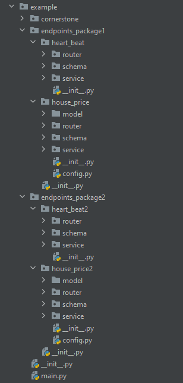

# How to Use?

FastAPI Hive Framework is the solution to the problems in why chapter.

---

## Install it.

```bash
pip3 install fastapi_hive
```


---

## Integrate it into your app

Note: You can reference demo code to complete this part. 

### Make packages and cornerstones  

First, create or refactor you code into packages&cornerstones:



From code view, router and service property must be set in __init__.py.

    app
        packages
            heartbeat
                api.py
                models.py
                service.py
                __init__.py


### Setup hive framework init codes 

Second, setup the init sentence of ioc_framework in main.py

```Python
from fastapi import FastAPI
from loguru import logger
from example.cornerstone.config import (APP_NAME, APP_VERSION, API_PREFIX,
                                        IS_DEBUG)

from fastapi_hive.ioc_framework import IoCFramework


def get_app() -> FastAPI:
    logger.info("app is starting.")

    fast_app = FastAPI(title=APP_NAME, version=APP_VERSION, debug=IS_DEBUG)

    ioc_framework = IoCFramework(fast_app)
    ioc_framework.config.API_PREFIX = API_PREFIX
    ioc_framework.config.ENDPOINT_PACKAGE_PATHS = ["./example/endpoints_package1", "./example/endpoints_package2"]
    ioc_framework.config.HIDE_PACKAGE_IN_URL = False
    ioc_framework.config.HIDE_MODULE_IN_URL = False
    ioc_framework.init_modules()

    @fast_app.get("/")
    def get_root():
        return "Go to docs URL to look up API: http://localhost:8000/docs"

    return fast_app


app = get_app()

```

## URL MAPPING

As you know, this framework will discover and load all cornerstones in all packages automatically.
So the API URLs contain package folder name or module folder name, in order to avoid conflicts and be sensible.

If the folder structure likes below

```text
    app
        packages
            heartbeat
                router.py
                models.py
                service.py
            prediction
                router.py
                models.py
                service.py
        main.py
```

Then, the API URLs will be like below:

```text
{API_PREFIX}/packages/heartbeat/xxx
{API_PREFIX}/packages/prediction/yyy
```

Note:

1. xxx is defined in packages/heartbeat/router.py
2. yyy is defined in packages/prediction/router.py

if your app don't want display package name in URL, you can turn on HIDE_PACKAGE_IN_URL of configuration.

```text
{API_PREFIX}/heartbeat/xxx
{API_PREFIX}/prediction/yyy
```
