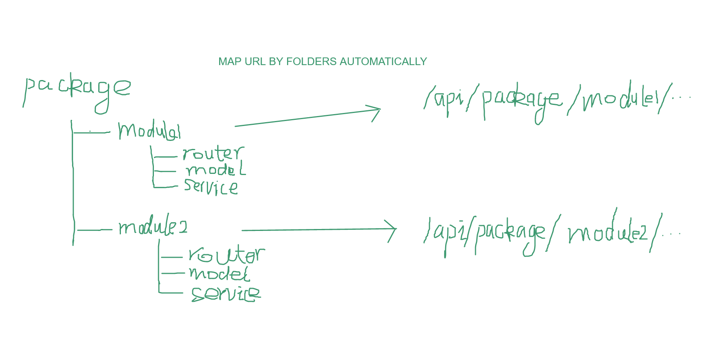
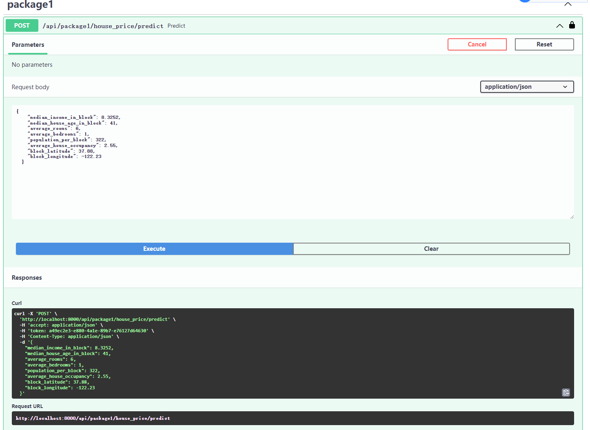

# FastAPI Hive


<p align="center">
    <em>FastAPI Hive Framework, packages&modules code management, developer-friendly, easy to be integrated.</em>
</p>


[](https://github.com/fanqingsong/fastapi-hive/actions)
[](https://codecov.io/gh/fanqingsong/fastapi-hive)
[](https://pypi.org/project/requests)
[](https://badge.fury.io/py/fastapi-hive)
[](https://github.com/fanqingsong/fastapi-hive)
[](https://pepy.tech/project/fastapi-hive)


Notes:

```text
Regular fastapi project setups some folders for storing specific function codes, 
such as router folder for api registering folder and model folder.
So one service codes have to exist in several folders, the problem is the maintenance issue of looking for them.
If you feel it is tiresome task, FastAPI Hive is just for you.

Every bee is thought as the entity of one service codes, including all function codes.
FastAPI Hive is the container for all bees.  
```


---

**Documentation**: <a href="https://fanqingsong.github.io/fastapi-hive" target="_blank">https://fanqingsong.github.io/fastapi-hive</a>

**Source Code**: <a href="https://github.com/fanqingsong/fastapi-hive" target="_blank">https://github.com/fanqingsong/fastapi-hive</a>

**PYPI**: <a href="https://pypi.org/project/fastapi-hive/" target="_blank">https://pypi.org/project/fastapi-hive/</a>

---

FastAPI Hive Framework is a developer friendly and easy to be integrated framework for managing your code by packages&modules folder structure.

The key features are:

* **Packages**: a top-level folder to contain all codes by service. 
* **Modules**: a sub-folder in packages, contains functional codes in service.
* **Router Mounting Automatically**: the router defined by module will be mounted into app automatically.
* **Service Mounting Automatically**: the service(such as ML model) defined by module will be mounted into app automatically, to reduce loading time during call.
* **Developer-Friendly**: all one-module codes are put in one same folders, all modules are managed by different packages.
* **Easy-to-be-Integrated**: Just several line codes to integrate it in your app.

<small>estimation based on tests by author, have a look at demo folder.</small>

## Overview

Folders are set in such layout, urls are mapped by folder structure automatically.



## Requirements

Python 3.7+

FastAPI Hive Framework stands on the shoulders of giants:

* <a href="https://fastapi.tiangolo.com/" class="external-link" target="_blank">FastAPI</a> web framework.

## Have a Try

### Installation 

#### install hive from pypi

```bash
pip3 install fastapi_hive
```

#### install hive from source code

First, git clone this repo.

```bash
git clone git@github.com:fanqingsong/fastapi-hive.git
```

Second, install ioc framework library<br/>
<small>Note: If just treat it as a library, and want to integrate it into your app, you can just run this command. </small>

```bash
pip3 install .
```

#### install dependency

Third, install the required packages for running demo in your local environment (ideally virtualenv, conda, etc.).
<small>Note: You can reference demo code to make up your own app in anywhere. </small>

```bash
pip3 install -r requirements.txt
``` 


### Setup
1. Duplicate the `.env.example` file and rename it to `.env` 


2. In the `.env` file configure the `API_KEY` entry. The key is used for authenticating our API. <br>
   A sample API key can be generated using Python REPL:
```python
import uuid
print(str(uuid.uuid4()))
```

### Run demo app

1. Start demo app with: 

production running command:

```bash
uvicorn demo.main:app
```

developing running command:
```bash
uvicorn demo.main:app --reload
```

2. Go to [http://localhost:8000/docs](http://localhost:8000/docs).
   
3. Click `Authorize` and enter the API key as created in the Setup step.

   
4. You can use the sample payload from the `docs/sample_payload.json` file when trying out the house price prediction model using the API.
   

## Run Tests

If you're not using `tox`, please install with:
```bash
pip3 install tox
```

Run your tests with: 
```bash
tox
```

This runs tests and coverage for Python 3.6 and Flake8, Autopep8, Bandit.

