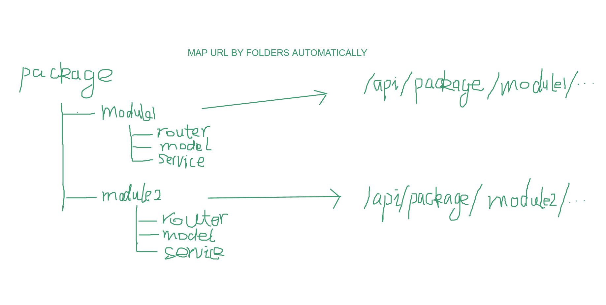
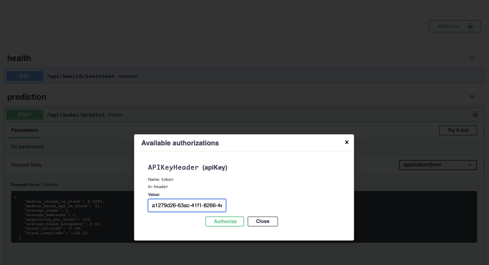
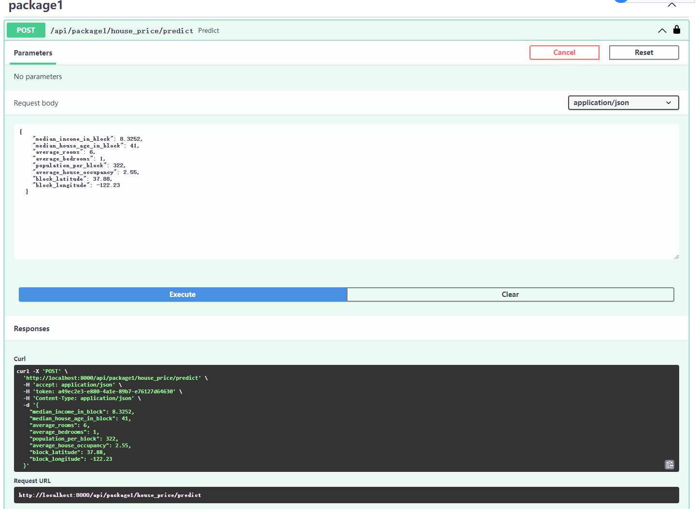

# What


<p align="center">
    <em>FastAPI Hive Framework, modulization of code layout, decoupling codes into foundations and endpoints, developer-friendly, easy to be integrated</em>
</p>


[](https://github.com/fanqingsong/fastapi-hive/actions)
[](https://codecov.io/gh/fanqingsong/fastapi-hive)
[](https://pypi.org/project/requests)
[](https://badge.fury.io/py/fastapi-hive)
[](https://github.com/fanqingsong/fastapi-hive)
[](https://pepy.tech/project/fastapi-hive)


Introduction:
===================

> Regular fastapi project setups some folders for storing specific function codes, 
such as router folder for api registering folder and model folder for defining db tables and pydantic data model.
> 
> So one service codes have to be splitted and exist in several folders, the problem is the code-review issue of looking for them with jumpping different folders again and again.
> 
> If you feel it is tiresome task like me, then FastAPI Hive is just for you.
> 
>Every bee is thought as the entity of one service codes, defined as endpoints, including all function codes(router, model).
FastAPI Hive is the container(bee's home) for all bees.  
>
> Also for these common function code, like database setup and authentication codes, they are defined as foundations, the structure the hive is built on. Every function code is put into one foundation folder together.


---

**Documentation**: <a href="https://fanqingsong.github.io/fastapi-hive" target="_blank">https://fanqingsong.github.io/fastapi-hive</a>

**Source Code**: <a href="https://github.com/fanqingsong/fastapi-hive" target="_blank">https://github.com/fanqingsong/fastapi-hive</a>

**PYPI**: <a href="https://pypi.org/project/fastapi-hive/" target="_blank">https://pypi.org/project/fastapi-hive/</a>

---

FastAPI Hive Framework is a developer friendly and easy to be integrated framework for managing your code by endpoints and foundations folder structure.


The key features are:

* **Foundation Container**: a top-level folder to layout codes by function folder, like db and authentication. 
* **Endpoint Container**: a top-level folder to layout service codes by endpoint folder,  
* **Endpoint folder**: a sub-folder in Endpoint Container, layout one service code by function folder(router, db, service, etc).
* **Explicit router mounting**: each endpoint includes its `APIRouter` from `startup` with `self.app.include_router(...)`.
* **Model Preloading Easily**: the service(such as ML model) defined by module will be mounted into app easily, in order to reduce loading time during endpoint request.
* **Developer-Friendly**: all one-endpoint/foundation codes are put in one same folders, easy to review and update.
* **Easy-to-be-Integrated**: Just several line codes to integrate it in your app.

<small>estimation based on tests by author with this project[**](https://github.com/fanqingsong/machine_learning_system_fastapi), have a look at example folder.</small>

## Overview

Folders are set in such layout. Each endpoint chooses its URL prefix when it mounts the router.



## Requirements

Python 3.8–3.13

FastAPI Hive Framework stands on the shoulders of giants:

* <a href="https://fastapi.tiangolo.com/" class="external-link" target="_blank">FastAPI</a> web framework.

## Have a Try

### Installation 

Install from the local checkout. The package published on PyPI can lag behind this repository.

First, git clone this repo.

```bash
git clone git@github.com:fanqingsong/fastapi-hive.git
cd fastapi-hive
```

Second, install the library from the local source.<br/>
<small>Note: If you just treat it as a library, and want to integrate it into your app, you can just run this command. </small>

```bash
pip3 install .
```

#### install dependency packages

Third, install the required packages for running demo in your local environment (ideally virtualenv, conda, etc.).
<small>Note: You can reference demo code to make up your own app in anywhere. </small>

```bash
pip3 install -r requirements.txt
``` 


### Setup
1. Duplicate the `example/.env.example` file and rename it to `example/.env` 


2. In the `example/.env` file configure the `API_KEY` entry. The key is used for authenticating our API. <br>
   A sample API key can be generated using Python REPL:
```python
import uuid
print(str(uuid.uuid4()))
```

### Run  app

Start the example from this repository so it uses the local checkout, not the PyPI release.

```bash
pip3 install -e .
pip3 install -r requirements.txt
uvicorn example.main:app --reload
```

The same local install and startup sequence is `make run-example`.

production running command:

```bash
uvicorn example.main:app
```

2. Go to [http://localhost:8000/docs](http://localhost:8000/docs).
   
3. Click `Authorize` and enter the API key as created in the Setup step.

   
4. You can use the sample payload from the `docs/sample_payload.json` file when trying out the house price prediction model using the API.
   

## Run Tests

If you're not using `tox`, please install with:
```bash
pip3 install tox
```

Run your tests with: 
```bash
tox
```

This runs the configured test, coverage, and code-quality environments.

## Package and Upload

For maintainer of this project, please follow:
Before these action, change version in setup.py

```bash
python3 setup.py sdist

twine upload dist/*

```


