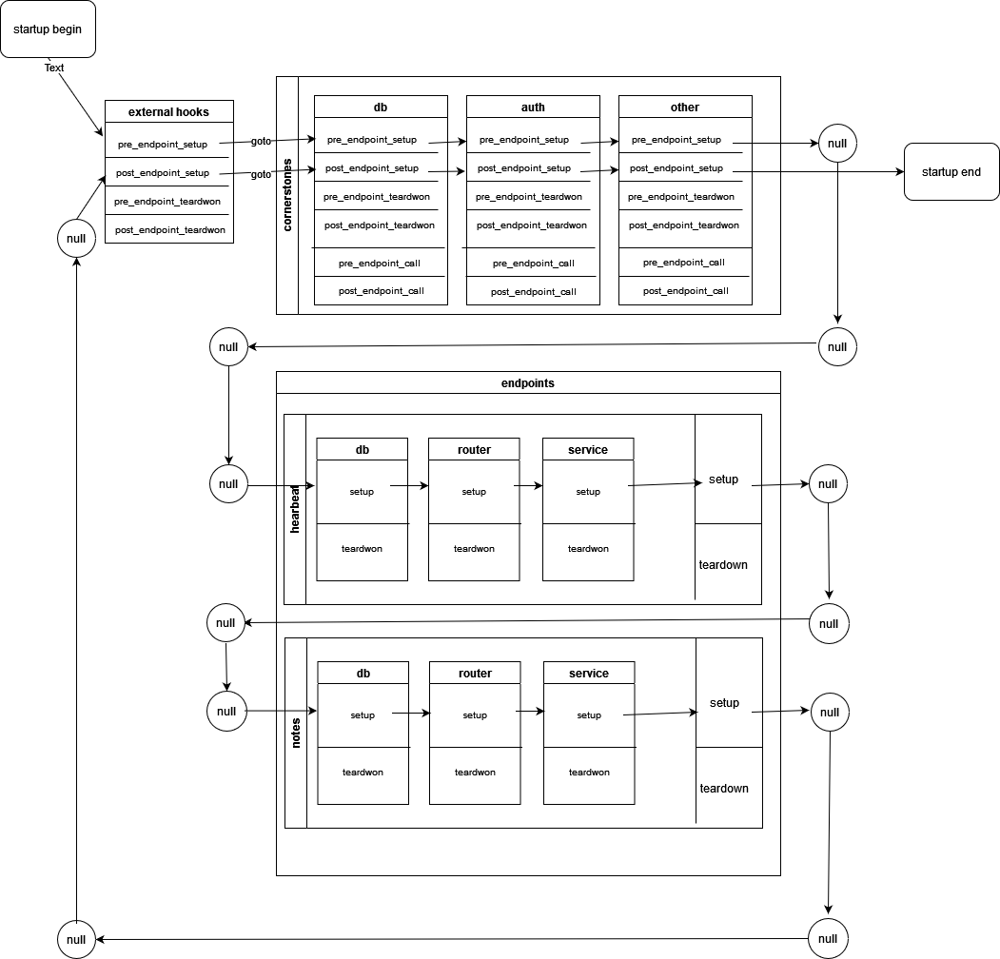
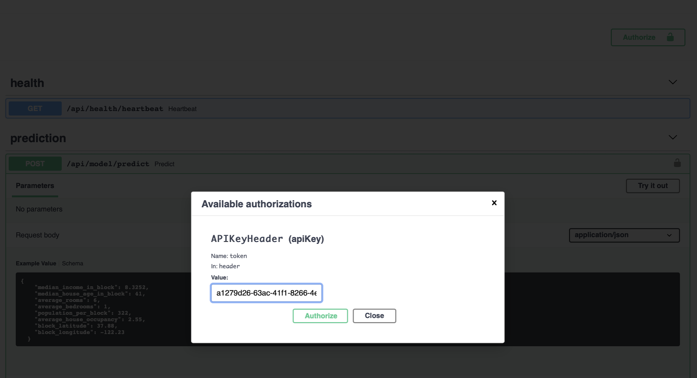
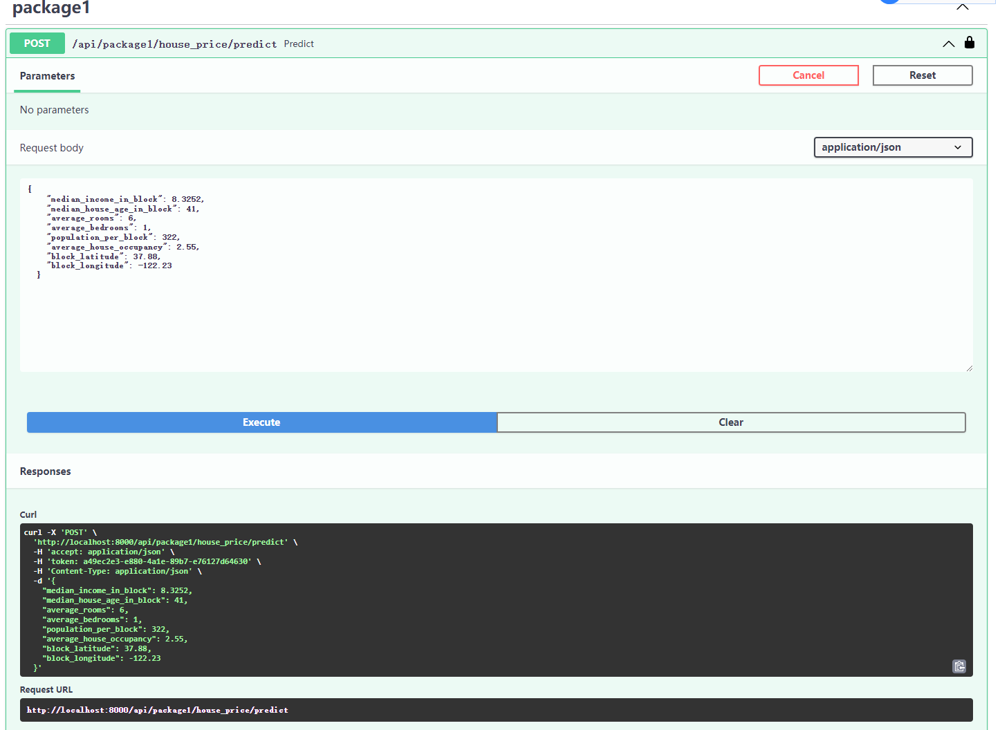

# What




<p align="center">
    <em>FastAPI Hive Framework, modulization code layout tools, decoupling codes into cornerstones and endpoints, developer-friendly, easy to be integrated</em>
</p>


[](https://github.com/fanqingsong/fastapi-hive/actions)
[](https://codecov.io/gh/fanqingsong/fastapi-hive)
[](https://pypi.org/project/requests)
[](https://badge.fury.io/py/fastapi-hive)
[](https://github.com/fanqingsong/fastapi-hive)
[](https://pepy.tech/project/fastapi-hive)


Introduction:
===================

> Regular fastapi project setups some folders for storing specific function codes, 
such as router folder for api registering folder and model folder for defining db tables and pydantic data model.
> 
> So one service codes have to be splitted and exist in several folders, the problem is the code-review issue of looking for them with jumpping different folders again and again.
> 
> If you feel it is tiresome task like me, then FastAPI Hive is just for you.
> 
>Every bee is thought as the entity of one service codes, defined as endpoints, including all function codes(router, model).
FastAPI Hive is the container(bee's home) for all bees.  
>
> Also for these common function code, like database setup and authentication codes, they are defined as cornerstones, which are key to construct bee's hive, every function code are put into one cornerstone folder together.


---

**Documentation**: <a href="https://fanqingsong.github.io/fastapi-hive" target="_blank">https://fanqingsong.github.io/fastapi-hive</a>

**Source Code**: <a href="https://github.com/fanqingsong/fastapi-hive" target="_blank">https://github.com/fanqingsong/fastapi-hive</a>

**PYPI**: <a href="https://pypi.org/project/fastapi-hive/" target="_blank">https://pypi.org/project/fastapi-hive/</a>

---

FastAPI Hive Framework is a developer friendly and easy to be integrated framework for managing your code by endpoints and cornerstones folder structure.


The key features are:

* **Conerstone Container**: a top-level folder to layout codes by function folder, like db and authentication. 
* **Endpoint Container**: a top-level folder to layout service codes by endpoint folder,  
* **Endpoint folder**: a sub-folder in Endpoint Container, layout one service code by function folder(router, db, service, etc).
* **Router Mounting Automatically**: the router defined by module will be mounted into app automatically.
* **Model Preloading Easily**: the service(such as ML model) defined by module will be mounted into app easily, in order to reduce loading time during endpoint request.
* **Developer-Friendly**: all one-endpoint/cornerstone codes are put in one same folders, easy to review and update.
* **Easy-to-be-Integrated**: Just several line codes to integrate it in your app.

<small>estimation based on tests by author with this project[**](https://github.com/fanqingsong/machine_learning_system_fastapi), have a look at example folder.</small>

## Overview

Folders are set in such layout, urls are mapped by folder structure automatically.


## Requirements

Python 3.7+

FastAPI Hive Framework stands on the shoulders of giants:

* <a href="https://fastapi.tiangolo.com/" class="external-link" target="_blank">FastAPI</a> web framework.

## Have a Try

### Installation 

#### install hive from pypi

```bash
pip3 install fastapi_hive
```

#### install hive from source code

First, git clone this repo.

```bash
git clone git@github.com:fanqingsong/fastapi-hive.git
```

Second, install ioc framework library of this container_name<br/>
<small>Note: If you just treat it as a library, and want to integrate it into your app, you can just run this command. </small>

```bash
pip3 install .
```

#### install dependency packages

Third, install the required packages for running demo in your local environment (ideally virtualenv, conda, etc.).
<small>Note: You can reference demo code to make up your own app in anywhere. </small>

```bash
pip3 install -r requirements.txt
``` 


### Setup
1. Duplicate the `.env.example` file and rename it to `.env` 


2. In the `.env` file configure the `API_KEY` entry. The key is used for authenticating our API. <br>
   A sample API key can be generated using Python REPL:
```python
import uuid
print(str(uuid.uuid4()))
```

### Run  app

1. Start example app with: 

production running command:

```bash
uvicorn example.main:app
```

developing running command:
```bash
uvicorn example.main:app --reload
```

2. Go to [http://localhost:8000/docs](http://localhost:8000/docs).
   
3. Click `Authorize` and enter the API key as created in the Setup step.

   
4. You can use the sample payload from the `docs/sample_payload.json` file when trying out the house price prediction model using the API.
   

## Run Tests

If you're not using `tox`, please install with:
```bash
pip3 install tox
```

Run your tests with: 
```bash
tox
```

This runs tests and coverage for Python 3.6 and Flake8, Autopep8, Bandit.

## Package and Upload

For maintainer of this project, please follow:
Before these action, change version in setup.py

```bash
python3 setup.py sdist

twine upload dist/*

```


